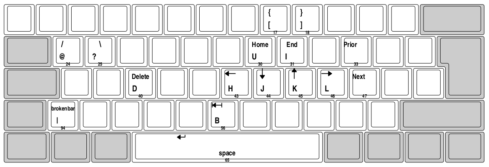

## Vim Mode 

The [vim mode](./vim_mode.ahk) scripts changes the bahaviour of the caps lock key as following: 

- capslock is disabled
- capslock acts as a modifier (similar to ctrl or alt), here called "vim mode"
- it changes the behaviour of the keys in the image below, such that e.g,
    - `CAPS` + `h`: Left Arrow
    - `CAPS` + `d`: Delete
    - `CAPS` + `p`: Page Up, and so forth ...
    - be aware that the image is not 100% consistent with the actual remaps, please check the source file.
- further, `vim mode` can be locked with `Shift+CAPS`.
- `vim mode` can be exited with `Esc`, `q`, `CAPS` and `Shift+CAPS`

- prior and next are pg up and down, respectively
- Space Bar => Return
- B => BackSpace